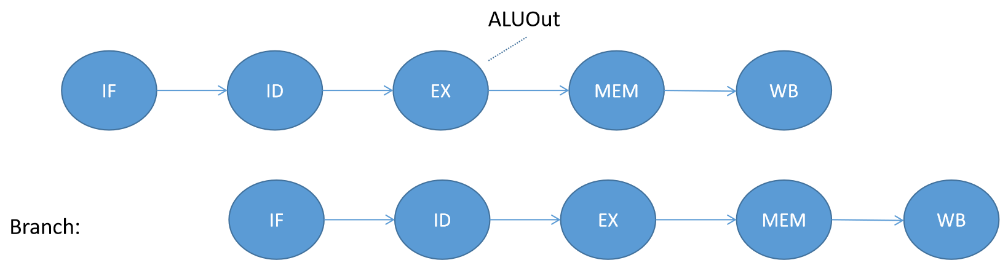

# MIPS五级流水线CPU

本仓库使用`verilog`编写MIPS五级流水线CPU。

## 设计方案

### 基本框架

5级流水线，并实现`forwarding`相关电路。同时，我也实现了`Branch`指令在`ID`阶段提前跳转的功能，并做出了一系列调整保证CPU安全稳定的运行，成功避免了冒险的产生，加速了CPU的运行。

存储结构上采用哈佛结构，数据存储器与指令存储器分离。

### 设计实现的指令集

设计的流水线CPU，能够实现大多数MIPS指令，在春季学期在单周期、多周期CPU上已实现的指令外，还增添了以下指令：`lb、bne、blez、bgtz、bltz、jal、jalr、jr、jalr` 等。

### 设计框图

设计框图如下：

## 原理说明与部分代码实现

### 控制信号

控制信号在我的代码中，由`Control.v`实现译码。根据指令的`OpCode`和`Funct`，将生成以下控制信号：`Branch、RegWrite、RegDst、MemRead、MemWrite、MemtoReg、ALUSrc1、ALUSrc2、ExtOp、LuOp、Jop、LoadByte`。

相比于多周期CPU，新增添的控制信号为`JOp`和`LoadByte`，前者用于指示该条指令是否为跳转指令，方便CPU进行跳转与stall；后者用于指示该条指令是否为`lb`指令，方便CPU从主存中直接取出字节。

### 五级流水线原理

将指令的执行阶段划分为5个阶段，分别为：指令获取（IF）、指令译码（ID）、计算执行（EX）、访问主存（MEM）、写回寄存器堆（WB）。每两个阶段间，设计一个暂存的寄存器，用于存储该条指令在接下来的阶段中会用到的控制信号。

由于总共需要有4组寄存器，来存取5个阶段间的信息传递，我将这4组寄存器命名为：`IF_ID、ID_EX、EX_MEM、MEM_WB`。其中`IF_ID`寄存器的输入有`flush`和`hold`信号，用于刷新与保持寄存器信息；`ID_EX`寄存器的输入有`flush`信号，用于刷新寄存器信息。它们的具体用法在下面涉及stall的时候详细介绍。

### Stall 原理与实现

#### 分支或跳转指令后stall

在分支指令或跳转指令后，由于两种指令我都设计为在`ID`阶段就完成跳转，因此在它们之后都只需要`stall`一个周期。`stall`的具体方法为：如果在`ID`阶段的`Branch`信号为真，或者`JOp`信号为真，则设置`IF_ID`寄存器的`flush`信号，使`IF_ID`寄存器在下一周期刷新，同时设置下一帧的`PC`为跳转的地址（若`Branch`指令判断为`False`，则`PC`还是会变为`PC+4`）。

设置`flush_IFID`的代码如下：

~~~verilog
assign flush_IFID = Branch_ID || JOp_ID;
~~~

设置`PC`下一帧的代码如下：

~~~verilog
assign PC_new = (RegWrite_EX && Branch_ID && (Rw_EX == rs_ID || Rw_EX == rt_ID) && Load_EX) ? PC_now - 4 :
hold_IFID ? PC_now :
PCSrc_ID == 1 ? {PC_ID[31:28], rs_ID, rt_ID, rd_ID, Shamt_ID, Funct_ID, 2'b00} :
PCSrc_ID == 2 ? dataA_ID + 4:
Branch_ID ? PC_Branch :
PC_now + 4;      
~~~

其中，第3行是针对`j`指令跳转的表达式，第4行是针对`jr`等指令跳转的表达式，第5行是针对`Branch`指令跳转的表达式。`Branch`指令在`ID`阶段就已完成判断，因此`PC_Branch`在`ID`阶段就已经被计算好，这样跳转就不会发生问题。

`PC_Branch`的计算方法如下

~~~verilog
assign PC_Branch = Branch_ID && Zero ? PC_ID + 4 + ImmExtShift_ID : PC_ID + 4; 
~~~

其中`Zero`信号会根据`Branch`指令的不同来对应产生，如`beq`指令产生两输入是否相等的信号，`bne`指令产生两输入是否不等的信号。

#### 分支指令前stall

由于在`ID`阶段提前判断了分支指令，这里可能会产生数据冒险，因此分支指令前也可能需要`stall`。

细节而言，分为两种情况：

##### 情形一：分支指令前是`R`型指令或计算型的`I`型指令

如果`Branch`的前一条指令是`R`型指令或计算型的`I`型指令，且前一条指令要写回的寄存器是分支指令需要用于比较的寄存器`rs`或`rt`时，会引起数据冒险。

如图所示，如果`Branch`前是`R`型指令或计算型的`I`型指令，且有数据冒险时，`ALU`的计算结果要到`Branch`指令的`ID`阶段结束之后才会被计算出来，这已经无法使用`forwarding`的方法让`Branch`指令正确运行了。此时需要让`Branch`指令`stall`一个周期后，再将前一条指令的`ALUOut`转发到`Branch`指令的`ID`阶段。如下图所示：

转发操作的实现在下面的转发单元中再仔细介绍，这里先介绍`stall`是如何实现的。

这里`Branch`指令需要`stall`一个周期，只需将`IF_ID`寄存器保持住，`ID_EX`寄存器刷新即可。

虽然在`stall`的时候，`PC`的值仍会变化，但是由于无论如何，当`Branch`指令执行完`ID`后，都会给`PC`一个新值，故此时`stall`不需要关注`PC`的变化。

##### 情形二：分支指令前是`lb`或`lw`指令

如果分支前的指令是`lb`或`lw`指令，且Load出来的数据要被`Branch`指令用到的话，也会引起数据冒险。与情形一不同，此时数据最早出现在Load指令的`MEM`阶段，因此`Branch`指令需要`stall`两个周期。

数据冒险如图所示：

`stall`两个周期后，就可以实现转发，示意图如下：

这里`stall`执行起来相比情形一，略微复杂一些。

具体操作是：首先要`flush`寄存器`IF_ID`和寄存器`ID_EX`，然后需要将`PC-4`。这是因为如果仅仅`hold` `IF_ID`寄存器，只能`stall`一个周期；只有通过`flush` `IF_ID`寄存器的同时，将当前`PC`（即已经执行到`Branch`的`ID`阶段时，在`IF`阶段取出来的`PC`）重新置为`PC-4`才能保证`stall`两个周期。

置为`PC-4`时一定是正确的，这是因为我已经确定了前一条被执行的指令是`Load`指令，而不是跳转或分支指令。

##### 情形一与情形二的代码细节

控制信号`flush_IFID`、`hold_IFID`、`flush_IDEX`的逻辑如下：

~~~verilog
assign flush_IFID = Branch_ID || JOp_ID;
assign hold_IFID = ((RegWrite_EX && Branch_ID && (Rw_EX == rs_ID || Rw_EX == rt_ID)) && Load_EX == 0) ||
                   (MemRead_EX && (rt_EX == rs_ID || rt_EX == rt_ID) && Load_EX);  // next inst is branch && !Load, stall || load use hazard
assign flush_IDEX = (RegWrite_EX && Branch_ID && (Rw_EX == rs_ID || Rw_EX == rt_ID)) ||
                    (MemRead_EX && (rt_EX == rs_ID || rt_EX == rt_ID) && Load_EX);
~~~

这里`hold_IFID`和`flush_IFID`的后面那部分是`Load-Use`冒险检测，前面那部分才是分支指令相关。

其中，`flush_IFID`与`hold_IFID`都是对`IF_ID`寄存器的控制，在不同情况下有着不同的优先级，具体实现代码如下：

~~~verilog
always @(posedge clk or posedge reset) begin
    if(reset || (flush_IFID && Load_EX)) begin      
        // flush
        // ...
    end
    else if (hold_IFID) begin
        // hold
        // ...
    end
    else if (flush_IFID) begin
        // flush
        // ...
    end
    else begin
        // decode
        OpCode <= Instruction[31:26];
        rs <= Instruction[25:21];
        rt <= Instruction[20:16];
        rd <= Instruction[15:11];
        Shamt <= Instruction[10:6];
        Funct <= Instruction[5:0];
        PC_ID <= PC_IF;
    end
end
~~~

当目前`EX`阶段是`Load`指令时，`flush_IFID`比`hold_IFID`有着更高的优先级，这是因为此时需要`stall`两个周期；当目前`EX`阶段不是`Load`指令时，`hold_IFID`比`flush_IFID`有更高的优先级。

设置`PC-4`的代码如下：

~~~verilog
assign PC_new = (RegWrite_EX && Branch_ID && (Rw_EX == rs_ID || Rw_EX == rt_ID) && Load_EX) ? PC_now - 4 :
hold_IFID ? PC_now :
PCSrc_ID == 1 ? {PC_ID[31:28], rs_ID, rt_ID, rd_ID, Shamt_ID, Funct_ID, 2'b00} :
PCSrc_ID == 2 ? dataA_ID + 4:
Branch_ID ? PC_Branch :
PC_now + 4;    
~~~

第1行就是设置`PC-4`的代码，具体逻辑是：如果`EX`阶段是`Load`，下一条指令是`Branch`，且`Load`要写回的寄存器是`Branch`要用到的，则下一帧的`PC`设为`PC-4`。

#### Load-Use冒险检测并stall

当前一条指令是`lb`或`lw`，下一条指令是`R`型指令或计算型的`I`型指令，且`Load`要写入的寄存器会被下一条指令用到时，会引起数据冒险。此时在`Load`指令后需要`stall`一个周期。原理图如下：

`Load`出来的数据最早在`MEM`阶段后才出现，而`Use`的时候在`EX`阶段就已经需要了，因此`Load`后要`stall`一个周期，并转发`LoadData`。如下图所示：

具体实现为：执行到`Load`指令的`EX`阶段时，可以判断下一条指令是否为`Use`且是否存在数据冒险。如果存在，则在下一周期保持`Use`指令的`IF_ID`寄存器，并清空`ID_EX`寄存器。

代码上就是：

~~~verilog
assign hold_IFID = ((RegWrite_EX && Branch_ID && (Rw_EX == rs_ID || Rw_EX == rt_ID)) && Load_EX == 0) ||
                   (MemRead_EX && (rt_EX == rs_ID || rt_EX == rt_ID) && Load_EX);  // next inst is branch && !Load, stall || load use hazard
assign flush_IDEX = (RegWrite_EX && Branch_ID && (Rw_EX == rs_ID || Rw_EX == rt_ID)) ||
                    (MemRead_EX && (rt_EX == rs_ID || rt_EX == rt_ID) && Load_EX);
~~~

上面代码中，`hold_IFID`与`flush_IDEX`的后半部分，是`Load-Use`的冒险检测部分。

### Forwarding 原理与实现

#### Forwarding 到`ID`阶段

由于在我的设计中，`Branch`指令需要在`ID`阶段提前判断，因此我需要实现转发到`ID`阶段的操作，以解决`Branch`指令中存在的数据冒险。

我设置了`BrForwardingA`和`BrForwardingB`两个转发单元控制信号，来控制`ID`阶段中`Branch`指令判断的两个输入。

`Branch`指令用于判断的两个输入变量，可以来自于三个方面：

- `WriteData_WB`：即上一条指令从`DataMem`中取出的数据，适用于分支指令前为`Load`指令的场景。
- `ALUOut_MEM`：即上一条指令的`ALU`输出，适用于分支指令前为`R`型指令或计算型`I`型指令的场景。
- `dataA_ID` or `dataB_ID`：直接从寄存器堆中根据`rs`与`rt`的值取出的数据，适用于没有数据冒险时的场景。

以上三个场景分别对应于`BrForwarding`控制信号为：2、1、0。

我设计的`Branch`转发单元实现如下：

~~~verilog
assign BrForwardingA = rs == Rw_WB && Load_WB ? 2 : rs == Rw_MEM && RegWrite_MEM ? 1 : 0;
assign BrForwardingB = rt == Rw_WB && Load_WB ? 2 : rt == Rw_MEM && RegWrite_MEM ? 1 : 0;
~~~

以`BrForwardingA`为例：

- 如果`rs == Rw_WB && Load_WB`，说明前一条指令是`Load`（已经`stall`了两个周期），且写回的寄存器与`rs`相同，因此将`BrForwardingA`设为2。
- 如果`rs == Rw_MEM && RegWrite_MEM`，说明前一条指令是`R`型指令或计算型`I`型指令（已经`stall`了一个周期），且写回的寄存器与`rs`相同，因此将`BrForwardingA`设为1。
- 没有数据冒险时，`BrForwardingA`默认是0。

然后，`ID`阶段对`Branch`判断的输入`BrJudger`，会根据`BrForwarding`信号进行选择，代码如下：

~~~verilog
assign BrJuderA = BrForwardingA == 1 ? ALUOut_MEM : BrForwardingA == 2 ? WriteData_WB : dataA_ID;
assign BrJuderB = BrForwardingB == 1 ? ALUOut_MEM : BrForwardingB == 2 ? WriteData_WB : dataB_ID;
~~~

#### Forwarding 到`EX`阶段

`EX`阶段`ALU`的输入，可能会有4种来源，分别是：

- `dataA_EX` or `dataB_EX`：从寄存器堆中读取出来并随流水线传到`EX`阶段的数据。
- 移位量`Shamt`或立即数`ImmExtOut`。
- `ALUOut_MEM`：上一条指令的`ALU`计算结果。
- `WriteData_WB`：上上条指令`ALU`计算结果，或者是上条指令`Load`的结果。

我设置的转发选择信号为`ALUChooseA`与`ALUChooseB`。以上四个场景分别对应于`ALUChoose`为：0、1、2、3。

我设计的转发单元代码如下：

~~~verilog
assign ALUChooseA = ALUSrcA_EX == 1 ? 1 :
                    (RegWrite_MEM && (Rw_MEM == rs_EX) && (Rw_MEM != 0)) ? 2 :   // 优先判断MEM阶段，即前一条指令
                    (RegWrite_WB && (Rw_WB == rs_EX) && (Rw_WB != 0)) ? 3 : 0;
assign ALUChooseB = ALUSrcB_EX == 1 ? 1 : 
                    (RegWrite_MEM && (Rw_MEM == rt_EX) && (Rw_MEM != 0)) ? 2 :   // 优先判断MEM阶段，即前一条指令
                    (RegWrite_WB && (Rw_WB == rt_EX) && (Rw_WB != 0)) ? 3 : 0;
~~~

这里，`ALUSrcA_EX`和`ALUSrcB_EX`是指令译码单元解码出来的

控制信号，用于指示是否要使用移位量或立即数。后面的判断就是关于转发的判断。

优先判断前一条指令是否满足转发条件，不满足时再判断前前条指令是否满足条件。

以`ALUChooseA`为例，判断的逻辑是：如果前一条指令要写回寄存器堆，且写回的寄存器为`rs`，且该寄存器不为`$0`，则将前一条指令的`ALU`输出转发到目前`EX`阶段指令的输入。如果前一条指令不满足转发条件，则看前前条指令（也包括前一条指令为`Load`的情况）。如果在`WB`阶段的要写回寄存器堆，且`WB`阶段写回的寄存器为`rs`，且该寄存器不是`$0`，则将要写回的值转发到`ALU`的输入。如果上述的转发条件都不满足，则直接使用从寄存器堆中读取的值。

有了`ALUChoose`信号后，就可以对`ALU`的输入进行选择，代码如下：

~~~verilog
assign ALUinA = ALUChooseA == 1 ? {27'h0000000, Shamt_EX} :
                ALUChooseA == 2 ? ALUOut_MEM :
    			ALUChooseA == 3 ? WriteData_WB: dataA_EX;
assign ALUinB = ALUChooseB == 1 ? ImmExtOut_EX :
    			ALUChooseB == 2 ? ALUOut_MEM :
    			ALUChooseB == 3 ? WriteData_WB: dataB_EX;
~~~

### 数据存储器

数据存储器的大小我设置为`512`个字大小，字节地址从`0x00000000`到`0x000007FF`。

在字节地址为`0x4000000C`的位置，我设置其对应外部`LEDs`的控制信息；在字节地址为`0x40000010`的位置，我设置其对应七段数码管的控制信息。

### Load Byte 的实现

`Load Byre`大体上和`Load Word`类似。我只是单独添加了一个`LoadByte`控制信号，并根据该控制信号来选择是`LoadByte`还是`LoadWord`。

大概思路是，先用`LoadWord`把一个字取出来，再根据地址的后2位，选取对应的`Byte`，并进行符号拓展后返回。

代码如下：

~~~verilog
assign ReadData_MEM = LoadByte_MEM == 0 ? ReadData_Temp :   
                      ALUOut_MEM[1:0] == 2'b00 ? {{24{ReadData_Temp[7]}}, ReadData_Temp[7:0]} :
                      ALUOut_MEM[1:0] == 2'b01 ? {{24{ReadData_Temp[15]}}, ReadData_Temp[15:8]} :
                      ALUOut_MEM[1:0] == 2'b10 ? {{24{ReadData_Temp[23]}}, ReadData_Temp[23:16]} :
                      {{24{ReadData_Temp[31]}}, ReadData_Temp[31:24]};
~~~

其中，`ReadData_Temp`是从`DataMemory`中读取出的字。

