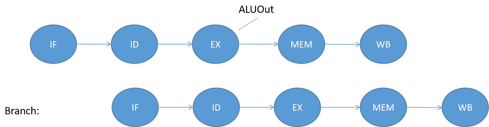
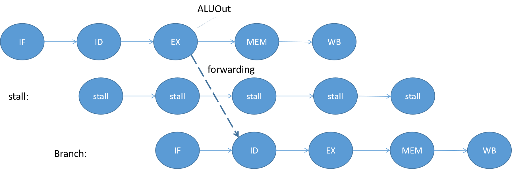

# 实验报告：MIPS五级流水线CPU

## 实验目的

设计一个支持MIPS指令集的五级流水线CPU，并利用此处理器完成字符串搜索算法。

## 设计方案

### 基本框架

5级流水线，并实现`forwarding`相关电路。同时，我也实现了`Branch`指令在`ID`阶段提前跳转的功能，并做出了一系列调整保证CPU安全稳定的运行，成功避免了冒险的产生，加速了CPU的运行。

### 设计实现的指令集

我设计的流水线CPU，能够实现大多数MIPS指令，在春季学期在单周期、多周期CPU上已实现的指令外，还增添了以下指令：`lb、bne、blez、bgtz、bltz、jal、jalr、jr、jalr` 等。

### 设计框图

### 原理说明与部分代码实现

#### 控制信号

控制信号在我的代码中，由`Control.v`实现译码。根据指令的`OpCode`和`Funct`，将生成以下控制信号：`Branch、RegWrite、RegDst、MemRead、MemWrite、MemtoReg、ALUSrc1、ALUSrc2、ExtOp、LuOp、Jop、LoadByte`。

相比于多周期CPU，新增添的控制信号为`JOp`和`LoadByte`，前者用于指示该条指令是否为跳转指令，方便CPU进行跳转与stall；后者用于指示该条指令是否为`lb`指令，方便CPU从主存中直接取出字节。

#### 五级流水线原理

将指令的执行阶段划分为5个阶段，分别为：指令获取（IF）、指令译码（ID）、计算执行（EX）、访问主存（MEM）、写回寄存器堆（WB）。每两个阶段间，设计一个暂存的寄存器，用于存储该条指令在接下来的阶段中会用到的控制信号。

由于总共需要有4组寄存器，来存取5个阶段间的信息传递，我将这4组寄存器命名为：`IF_ID、ID_EX、EX_MEM、MEM_WB`。其中`IF_ID`寄存器的输入有`flush`和`hold`信号，用于刷新与保持寄存器信息；`ID_EX`寄存器的输入有`flush`信号，用于刷新寄存器信息。它们的具体用法在下面涉及stall的时候详细介绍。

#### Stall 原理与实现

##### 分支或跳转指令后stall

在分支指令或跳转指令后，由于两种指令我都设计为在`ID`阶段就完成跳转，因此在它们之后都只需要`stall`一个周期。`stall`的具体方法为：如果在`ID`阶段的`Branch`信号为真，或者`JOp`信号为真，则设置`IF_ID`寄存器的`flush`信号，使`IF_ID`寄存器在下一周期刷新，同时设置下一帧的`PC`为跳转的地址（若`Branch`指令判断为`False`，则`PC`还是会变为`PC+4`）。

设置`flush_IFID`的代码如下：

~~~assembly
assign flush_IFID = Branch_ID || JOp_ID;
~~~

设置`PC`下一帧的代码如下：

~~~assembly
assign PC_new = (RegWrite_EX && Branch_ID && (Rw_EX == rs_ID || Rw_EX == rt_ID) && Load_EX) ? PC_now - 4 :
hold_IFID ? PC_now :
PCSrc_ID == 1 ? {PC_ID[31:28], rs_ID, rt_ID, rd_ID, Shamt_ID, Funct_ID, 2'b00} :
PCSrc_ID == 2 ? dataA_ID + 4:
Branch_ID ? PC_Branch :
PC_now + 4;      
~~~

其中，第3行是针对`j`指令跳转的表达式，第4行是针对`jr`等指令跳转的表达式，第5行是针对`Branch`指令跳转的表达式。`Branch`指令在`ID`阶段就已完成判断，因此`PC_Branch`在`ID`阶段就已经被计算好，这样跳转就不会发生问题。

`PC_Branch`的计算方法如下

~~~assembly
assign PC_Branch = Branch_ID && Zero ? PC_ID + 4 + ImmExtShift_ID : PC_ID + 4; 
~~~

其中`Zero`信号会根据`Branch`指令的不同来对应产生，如`beq`指令产生两输入是否相等的信号，`bne`指令产生两输入是否不等的信号。

##### 分支指令前stall

由于在`ID`阶段提前判断了分支指令，这里可能会产生数据冒险，因此分支指令前也可能需要`stall`。

细节而言，分为两种情况：

###### 情形一：分支指令前是`R`型指令或计算型的`I`型指令

如果`Branch`的前一条指令是`R`型指令或计算型的`I`型指令，且前一条指令要写回的寄存器是分支指令需要用于比较的寄存器`rs`或`rt`时，会引起数据冒险。

如图所示，如果`Branch`前是`R`型指令或计算型的`I`型指令，且有数据冒险时，`ALU`的计算结果要到`Branch`指令的`ID`阶段结束之后才会被计算出来，这已经无法使用`forwarding`的方法让`Branch`指令正确运行了。此时需要让`Branch`指令`stall`一个周期后，再将前一条指令的`ALUOut`转发到`Branch`指令的`ID`阶段。如下图所示：

转发操作的实现在下面的转发单元中再仔细介绍，这里先介绍`stall`是如何实现的。

这里`Branch`指令需要`stall`一个周期，只需将`IF_ID`寄存器保持住，`ID_EX`寄存器刷新即可。虽然在`stall`的时候，`PC`的值仍会变化，但是由于无论如何，当`Branch`指令执行完`ID`后，都会给`PC`一个新值，故此时`stall`不需要关注`PC`的变化。